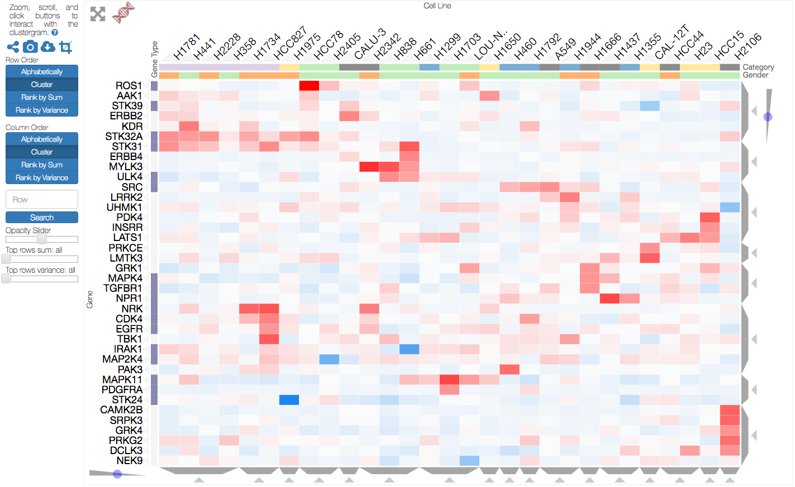

<!-- # clustergrammer -->
<!-- #  -->

Clustergrammer is a web-based tool for visualizing high-dimensional data (e.g. a matrix) as an interactive and shareable hierarchically clustered heatmap. Clustergrammer's front end ([Clustergrammer-JS](http://clustergrammer.readthedocs.io/clustergrammer_js.html#clustergrammer-js)) is built using [D3.js](https://d3js.org/) and its back-end ([Clustergrammer-PY](http://clustergrammer.readthedocs.io/clustergrammer_py.html#clustergrammer-py)) is built using Python. Clustergrammer produces highly interactive visualizations that enable intuitive exploration of high-dimensional data and has several biology-specific features (e.g. enrichment analysis, see [Biology-Specific Features](http://clustergrammer.readthedocs.io/biology_specific_features.html#biology-specific-features)) to facilitate the exploration of gene-level biological data. Click the screenshot below to view an interactive tutorial:

Clustergrammer's interacive features include:
- [Zooming and Panning](http://clustergrammer.readthedocs.io/interacting_with_viz.html#zooming-and-panning)
- [Row and Column Reordering](http://clustergrammer.readthedocs.io/interacting_with_viz.html#row-col-reordering)
- [Interactive Dendrogram](http://clustergrammer.readthedocs.io/interacting_with_viz.html#interactive-dendrogram)
- [Interactive Dimensionality Reduction](http://clustergrammer.readthedocs.io/interacting_with_viz.html#interactive-dim-reduction)
- [Interactive Categories](http://clustergrammer.readthedocs.io/interacting_with_viz.<html id="interactive-categories"></html>)
- [Cropping](http://clustergrammer.readthedocs.io/interacting_with_viz.html#crop)
- [Row Searching](http://clustergrammer.readthedocs.io/interacting_with_viz.html#search)

Clustergrammer can be used in three main ways (this repo contains the source code for [Clustergrammer-JS](http://clustergrammer.readthedocs.io/clustergrammer_js.html#clustergrammer-js)):

- [Clustergrammer Web App](http://clustergrammer.readthedocs.io/clustergrammer_web.html#clustergrammer-web) ([http://amp.pharm.mssm.edu/clustergrammer/](http://amp.pharm.mssm.edu/clustergrammer/))
- [Clustergrammer Jupyter Widget](http://clustergrammer.readthedocs.io/clustergrammer_widget.html#clustergrammer-widget)
- [Clustergrammer-JS](http://clustergrammer.readthedocs.io/clustergrammer_js.html#clustergrammer-js) and [Clustergrammer-PY](http://clustergrammer.readthedocs.io/clustergrammer_py.html#clustergrammer-py) libraries

For information about building a webpage or app using Clustergrammer see: [Web-Development with Clustergrammer](http://clustergrammer.readthedocs.io/building_webpage.html)

# Using Clustergrammer

Pleae see Clustergramer's [documentation](http://clustergrammer.readthedocs.io/) for detailed information or select a specific topic below:

- [Getting Started](http://clustergrammer.readthedocs.io/getting_started.html)
- [Interacting with the Visualization](http://clustergrammer.readthedocs.io/interacting_with_viz.html)
- [Web-Development with Clustergrammer](http://clustergrammer.readthedocs.io/building_webpage.html) ([example pages](http://clustergrammer.readthedocs.io/clustergrammer_js.html#example-pages))
- [Clustergrammer Web App](http://clustergrammer.readthedocs.io/clustergrammer_web.html#clustergrammer-web) and [Clustergrammer Jupyter Widget](http://clustergrammer.readthedocs.io/clustergrammer_widget.html#clustergrammer-widget)
- [Matrix Formats and Input/Output](http://clustergrammer.readthedocs.io/matrix_format_io.html)
- [Clustergrammer-JS](http://clustergrammer.readthedocs.io/clustergrammer_js.html)
- [Clustergrammer-PY](http://clustergrammer.readthedocs.io/clustergrammer_py.html)
- [App Integration Examples](http://clustergrammer.readthedocs.io/app_integration.html)
- [Biology-Specific Features](https://clustergrammer.readthedocs.io/biology_specific_features.html)
- [Case Studies and Examples](https://clustergrammer.readthedocs.io/case_studies.html)
- [Developing Clustergrammer](https://clustergrammer.readthedocs.io/developing_with_clustergrammer.html)

## Licensing
Clustergrammer was developed by Nicolas Fernandez in the [Ma'ayan lab](http://labs.icahn.mssm.edu/maayanlab/) at the [Icahn School of Medicine at Mount Sinai](http://icahn.mssm.edu/). Clustergrammer's license and third-party licenses are in the LICENSES directory and more information can be found at [Clustergrammer License](https://clustergrammer.readthedocs.io/license.html).
